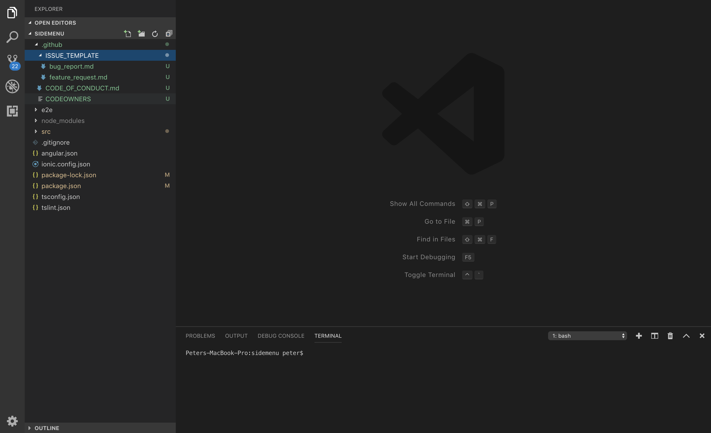

# GITHUB FOLDER
## Automtically generate the .github folder
-------------------

## Installation

You can either install it from vscode or from the following link:

https://marketplace.visualstudio.com/items?itemName=PeterHdd.github-folder

## Information

This vscode extension will automtically create a .github folder that will contain the issue template files, codeowner file and code of conduct file.

**Note:** Don't forget to add your username to the specific files.

## Usage

Right click on the explorer space and choose *Create .github folder*

